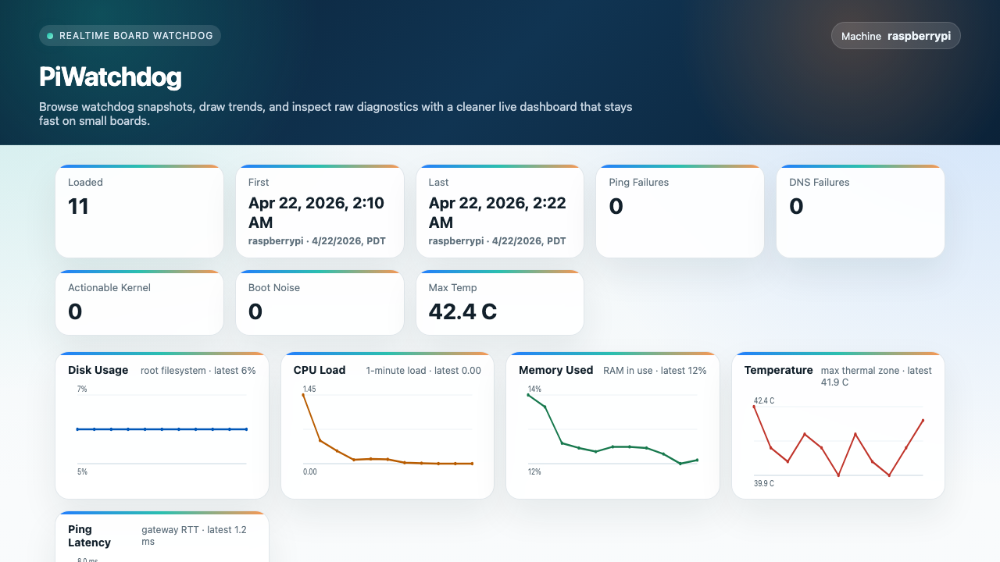

# PiWatchdog

PiWatchdog is a lightweight watchdog logger and web UI for Raspberry Pi, Rock Pi, and similar Debian or Ubuntu-based Linux boards.

It does two things:

1. Logs recurring health snapshots with `systemd`
2. Serves a small web UI so you can inspect recent history, charts, raw diagnostic blocks, speed tests, alerts, containers, and maintenance status

## Screenshot



The project is intentionally self-contained:

- no Python packages to install
- no Node.js
- no database required
- no Docker dependency, but Docker is detected when available

## What it records

Each watchdog snapshot records:

- uptime
- load average
- memory usage
- filesystem usage
- interface and route state
- Wi-Fi status
- socket summary
- Docker container status, if Docker exists
- temperature sensors
- gateway ping
- DNS resolution checks
- recent kernel warnings

When ping or DNS fails, it also records extra diagnostics such as:

- `resolvectl status`
- `nmcli` status
- `wlan0` details
- recent network-related journals
- interface counters
- gateway neighbor table

## What the web UI shows

- summary cards
- mobile-friendly table
- newest-first or oldest-first sorting
- browser-local timezone rendering
- trend charts for:
  - disk usage
  - CPU load
  - memory usage
  - temperature
  - ping latency
- clickable chart expansion with hover labels
- auto-load mode that redraws charts and appends new rows without reloading the page
- readable/raw snapshot inspector
- LAN speed test between the browser and the Pi
- network quality timeline for saved speed test results
- event timeline for notable watchdog findings
- in-page alerts for disk, temperature, DNS, ping, and containers
- container health panel when Docker is available
- maintenance panel for log rotation, cleanup status, reboot history, and storage breakdown

## LAN speed tests

The UI can measure local network speed between the browser and the Pi:

- `Download` measures Pi to browser throughput
- `Upload` measures browser to Pi throughput
- available test sizes go up to `1 GB`
- each successful result is saved to a small JSONL history file
- history includes client label, client IP, Mbps, direction, quality badge, and latest watchdog ping avg/max

By default, speed history is stored under the web UI service user's home directory:

```text
~/.local/share/pi-watchdog/speed-history.jsonl
```

Use the browser label field to distinguish devices or locations, such as `MacBook`, `iPhone upstairs`, or `office desktop`.

## Alerts

The current in-page alert checks are:

- disk over `80%`
- temperature over `70 C`
- DNS failed for `5` consecutive watchdog snapshots
- gateway ping failed for `5` consecutive watchdog snapshots
- Docker container not running, when Docker is available

Alerts are local to the web UI for now. Webhook or email delivery can be added later.

## Requirements

Tested on Debian and Ubuntu-style systems with:

- `systemd`
- `bash`
- `python3`
- `iproute2`
- `ping`
- `getent`

Optional but supported:

- `NetworkManager`
- `docker`
- `resolvectl`
- `journalctl`
- `iw`
- `nmcli`

## Quick setup

Copy the project to the Pi and run:

```bash
cd PiWatchdog
sudo ./setup.sh
```

Default install behavior:

- installs app files into `/opt/pi-watchdog`
- writes logs to `/var/log/pi-watchdog.log`
- creates:
  - `pi-watchdog-log.service`
  - `pi-watchdog-log.timer`
  - `pi-watchdog-ui.service`
- serves the UI on port `8098`

Then open:

```text
http://YOUR-PI-IP:8098/
```

## Setup options

You can override the defaults with environment variables:

```bash
sudo PI_WATCHDOG_USER=pi \
     PI_WATCHDOG_PORT=8098 \
     PI_WATCHDOG_INSTALL_DIR=/opt/pi-watchdog \
     PI_WATCHDOG_LOG_PATH=/var/log/pi-watchdog.log \
     PI_WATCHDOG_SPEED_HISTORY_PATH=/home/pi/.local/share/pi-watchdog/speed-history.jsonl \
     ./setup.sh
```

Available variables:

- `PI_WATCHDOG_USER`
- `PI_WATCHDOG_PORT`
- `PI_WATCHDOG_INSTALL_DIR`
- `PI_WATCHDOG_LOG_PATH`
- `PI_WATCHDOG_SPEED_HISTORY_PATH`

## Updating

If you update the project files later, run setup again:

```bash
sudo ./setup.sh
```

That refreshes the installed scripts and restarts the services.

## Useful commands

Check timer and services:

```bash
systemctl status pi-watchdog-log.timer
systemctl status pi-watchdog-ui.service
```

Watch the log:

```bash
sudo tail -n 100 /var/log/pi-watchdog.log
```

See the last UI service logs:

```bash
sudo journalctl -u pi-watchdog-ui.service -n 100 --no-pager
```

## Uninstall

```bash
sudo systemctl disable --now pi-watchdog-log.timer pi-watchdog-ui.service
sudo rm -f /etc/systemd/system/pi-watchdog-log.service
sudo rm -f /etc/systemd/system/pi-watchdog-log.timer
sudo rm -f /etc/systemd/system/pi-watchdog-ui.service
sudo systemctl daemon-reload
sudo rm -rf /opt/pi-watchdog
sudo rm -f /var/log/pi-watchdog.log
rm -f ~/.local/share/pi-watchdog/speed-history.jsonl
```

## Notes

- The UI intentionally loads a recent window instead of the entire lifetime log so it stays fast on small boards.
- Kernel boot-time noise is visually separated from active warnings.
- The UI uses plain HTTP by default. If you want HTTPS and HTTP/2, put a reverse proxy like Caddy or nginx in front of it.
